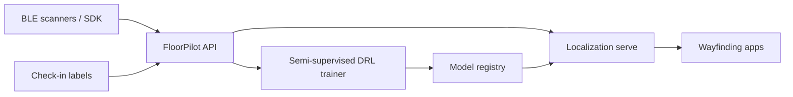

# FloorPilot

**Source:** `ai-in-iot/1810.04118v1/`
**Domain:** `ai-iot`
**One-liner:** A smart-building indoor localization service that learns BLE fingerprint policies from sparse user-confirmed labels plus abundant unlabeled RSSI, so campuses stop surveying every square meter to keep wayfinding accurate.
**Wedge:** Mid-size campuses, museums, and corporate buildings already deploying iBeacon/BLE beacons that cannot afford continuous supervised fingerprint campaigns.
**Positioning:** Semi-supervised localization ops — not another fingerprint database. The source shows deep reinforcement learning with a VAE inference engine that consumes unlabeled RSSI to generalize policies, cutting distance-to-target error ~23% and more than doubling rewards versus supervised-only DRL.

## Market research synthesis

### Thesis from source

People spend over 87% of daily life indoors; location-aware indoor services (wayfinding, access, museum content, campus navigation) are foundational smart-city / smart-building capabilities. The binding constraint is labeled training data: IoT sensors generate continuous RSSI but humans rarely confirm ground-truth positions. The paper’s contribution is extending deep reinforcement learning into a semi-supervised regime — Variational Autoencoders as the inference engine for generalizing optimal policies from mixed labeled and unlabeled observations — applied to BLE indoor localization.

Empirically, the semi-supervised agent improves distance-to-target by about 23% for a small number of training epochs and obtains at least 67% more rewards (and roughly 2× on average rewards) versus a supervised DRL baseline. The commercial implication is not “use RL for fun,” but that localization quality can improve after initial survey by absorbing unlabeled walk traces and occasional user feedback instead of re-surveying the floorplan.

### Buyer & economic model

- **Primary buyer:** Director of Smart Buildings / Digital Campus; secondary: museum digital experience leads and BLE infrastructure vendors’ services arms.
- **Users:** facilities localization admins, beacon technicians, wayfinding app owners, data scientists tuning policies, privacy officers.
- **Budget owner / value metric:** facilities digital budget and visitor experience budget. Value metrics: median localization error (meters), survey labor hours avoided, share of sessions within SLA accuracy, time-to-adapt after floorplan/furniture change.
- **Competing status quo:** manual fingerprint survey campaigns; proprietary RTLS; cloud-only ML that demands dense labels; supervised DRL prototypes that degrade between surveys.

### Domain constraints

- **Regulatory / trust / safety:** indoor location is sensitive personal data; purpose limitation for wayfinding vs marketing; accessibility requirements for evacuation use cases.
- **Data sensitivity:** RSSI traces can reconstruct movement paths; unlabeled data still implicates individuals.
- **Change-management realities:** beacon battery/placement drift invalidates models; staff will not label continuously — feedback must be opportunistic (check-in, QR room confirm).

## Business requirements

- BR-1: Localization policies must improve when unlabeled RSSI traces are admitted under policy, without requiring a full re-survey.
- BR-2: Operators must be able to inject sparse human-confirmed positions (room / grid cell) as rewards that update the agent within a defined training window.
- BR-3: Median and P95 distance-to-target must be reported per floor and compared against a supervised-only baseline for the same beacon map.
- BR-4: Beacon map changes (add/remove/move) must trigger a controlled relearn with a freeze period where the prior policy remains serving until the new policy passes accuracy gates.
- BR-5: Personal movement paths must be retained only under site consent and purpose; exports for analytics must be aggregated or pseudonymous.
- BR-6: Wayfinding consumers must receive a confidence signal when the estimate is outside SLA so apps can fall back to last known floor/zone.
- BR-7: Training jobs must be auditable: labeled vs unlabeled volume, epochs, reward totals, and promotion decision.
- BR-8: Multi-building tenants must isolate models and data by site; no cross-tenant leakage of fingerprints.
- BR-9: Evacuation / life-safety modes, if enabled, require a separately approved model version and cannot use marketing-purpose data.
- BR-10: Commercial packaging prices by active floors and monthly localization API volume.
- BR-11: False-room rate on held-out check-ins must stay under an operator-set threshold before auto-promotion.
- BR-12: Unlabeled data admission must be kill-switchable if drift or privacy review demands it.

## User stories

Canonical user stories live in sibling [USER_STORIES.md](USER_STORIES.md).

## System design

### Overview

FloorPilot ingests BLE RSSI observations from mobile or gateway listeners, maintains per-site beacon maps, trains semi-supervised DRL localization policies that mix sparse confirmed positions with unlabeled traces (VAE-backed policy generalization), serves location estimates with confidence, and gates model promotion on accuracy SLAs.

### Actors & boundaries

- **Actors:** localization admin, technician, wayfinding app, end visitor/employee, data scientist, privacy officer, operator.
- **Trust boundary:** raw RSSI and path estimates stay within the tenant site boundary; only aggregated metrics leave for billing/ops.
- **Human-in-the-loop points:** label confirmations; map change approval; model promotion; privacy purpose configuration.

### Core capabilities

1. **Site and beacon map management** — floors, beacon IDs, placements, health.
2. **Observation ingest** — RSSI vectors with device pseudonyms and timestamps.
3. **Sparse label capture** — confirmed positions / check-ins as rewards.
4. **Semi-supervised policy training** — labeled + unlabeled admission, VAE-backed generalization.
5. **Realtime localization API** — estimate, confidence, floor/zone.
6. **Model governance** — versions, freeze, promote, rollback, audit.
7. **Accuracy reporting** — distance and reward KPIs vs baseline.
8. **Privacy controls** — purpose, retention, kill-switch for unlabeled.

### Conceptual data

- **Primary entities:** Site, Floor, Beacon, ObservationBatch, PositionLabel, PolicyModel, LocalizationEstimate, AccuracyReport, ConsentPurpose.
- **Critical events:** beacon relocated, label confirmed, training completed, model promoted, estimate below confidence, unlabeled admission disabled.
- **Retention / audit needs:** policy versions and accuracy reports retained for the contract term; raw RSSI retained short; labels retained longer for audit of promotions.

### Integrations (conceptual)

- **Systems of record:** beacon management / CMDB, campus GIS / floorplans, wayfinding mobile apps, access-control systems (optional zone triggers).
- **Upstream signals:** BLE scanners, mobile SDKs, occasional QR/NFC room confirms.
- **Downstream actions:** map UI updates, door unlock suggestions (non-life-safety), analytics heatmaps (aggregated).

### High-level architecture

### Success metrics

- **Leading:** unlabeled traces admitted/week; labels per floor/week; training jobs passing accuracy gate.
- **Lagging:** median/P95 meters error; survey hours avoided; wayfinding task completion time.

## OpenAPI skeleton

Canonical HTTP surface lives in sibling `openapi.yaml`. Summarize here:

- **Base path:** `/v1/...`
- **Auth:** API key and/or Bearer JWT (operator)
- **Resource groups:** Sites, Observations, Labels, Policies, Estimates, Reports
