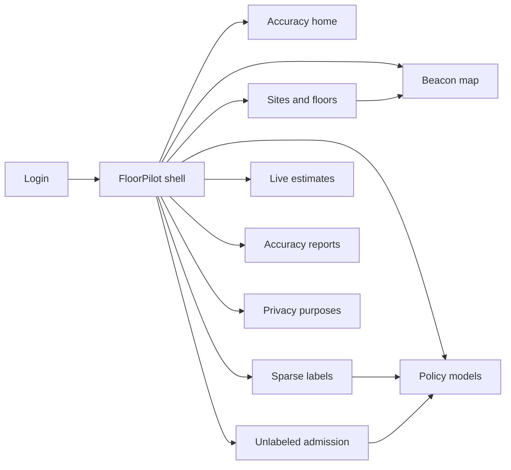
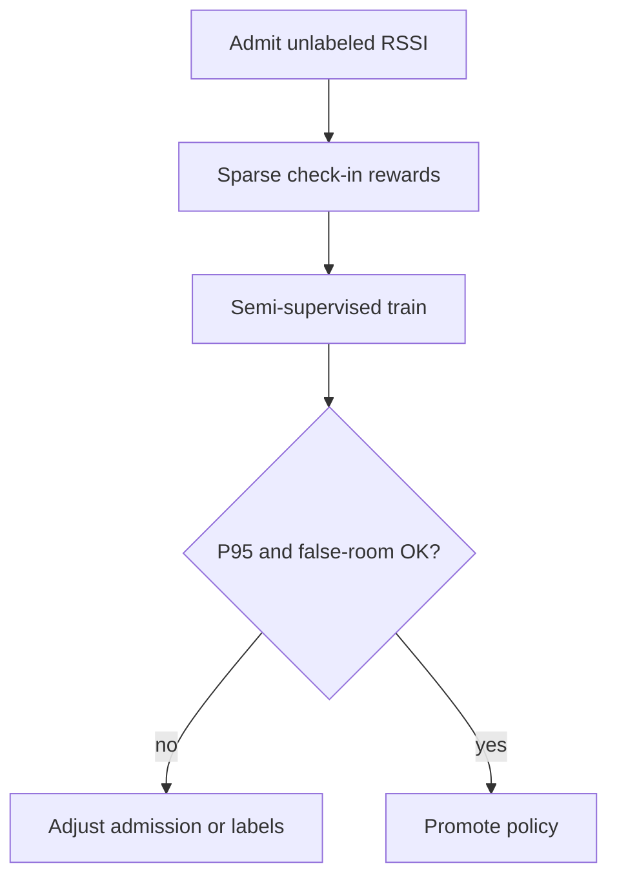

# FloorPilot — Web app

**Product:** [PRODUCT.md](./PRODUCT.md)
**Primary surface:** Smart-building localization ops console (beacon maps + semi-supervised policy governance)
**Secondary surfaces:** Accuracy board report (supervised vs semi-supervised); wayfinding confidence debug viewer
**Design thesis:** FloorPilot is a floor that learns from footsteps, not a survey clipboard — the UI metaphor is a freeze-and-promote runway over a beacon map where sparse check-ins light reward pins and unlabeled walk traces form a soft fog that improves the policy without claiming false certainty. Visual language is cool limestone and pilot-blue path ribbons on a soft atrium ground: confident estimates draw crisp; below-SLA estimates dissolve to zone haze. The brand wordmark sits as a quiet floor seal on every map-bearing screen so admins know whose meters-error contract they are flying.

## UX research synthesis

### Category peers (best-in-class)

- **Mappedin / Esri Indoors:** Floorplan-first wayfinding with confidence and multi-building sites. Steal: per-floor geometry as the spine; reject pin-perfect UI when confidence is low.
- **Kontakt.io / Estimote beacon consoles:** Beacon health, battery, relocate workflows. Steal: offline/relocated beacon flags that invalidate trust in dead RSSI; reject ignoring placement drift.
- **Google Maps Indoor / Apple Indoor Survey:** Survey labor as the expensive path. Steal: make “skip full re-survey” the ROI story with supervised-vs-semi metrics; reject continuous mandatory labeling.
- **Pointr / MazeMap campus ops:** Campus multi-building isolation and SLA accuracy. Steal: tenant/site isolation chrome; reject cross-site fingerprint bleed in UI.

### Patterns to adopt / reject

- **Adopt:** Sparse label capture as opportunistic rewards; unlabeled admission with kill switch; freeze prior policy while relearn runs; median/P95 vs supervised baseline; confidence signal to apps; purpose tags (wayfinding vs marketing vs evacuation); false-room gate before auto-promote.
- **Reject:** Fingerprint-database browser as home; always-on path replay of individuals; marketing using evacuation-grade models; purple “AI wayfinding” glow; survey-crew scheduling as the only improvement path.

### Trust, density, and workflow constraints from PRODUCT.md

Labeled data is scarce (BR-1, BR-2): improvement must come from unlabeled + sparse confirms. Furniture/beacon moves need freeze-and-promote (BR-4). Accuracy must beat supervised-only baseline visibly (BR-3, BR-7, BR-11). Location is sensitive (BR-5, BR-8, BR-9, BR-12): purpose, site isolation, unlabeled kill switch, separate evacuation models. Apps need confidence for fallback (BR-6).

## Information architecture

### Nav model

### Roles → default home

| Role | Default home | Why |
|------|--------------|-----|
| Facilities localization admin | Accuracy home | Justify skip survey (BR-3) |
| Wayfinding product owner | Live estimates + confidence | App fallback (BR-6) |
| Beacon technician | Beacon map | Offline/relocated flags |
| Data scientist | Unlabeled admission + training audit | Admission ratios (BR-7) |
| Privacy officer | Privacy purposes | Wayfinding vs marketing (BR-5, BR-9) |

### Cross-links to OpenAPI resources

| Nav area | OpenAPI tags / resources |
|----------|---------------------------|
| Sites, floors, beacons | Sites |
| RSSI observation batches | Observations |
| Position labels / check-ins | Labels |
| Policy models, promote | Policies |
| Localization estimates | Estimates |
| Accuracy reports | Reports |

## Screen inventory

### Accuracy home

- **Purpose:** Answer “is semi-supervised beating supervised-only enough to skip a re-survey?” in one composition.
- **Entry:** Admin default post-login.
- **Layout regions:** Brand + site/floor switcher; median/P95 meters; supervised baseline compare; unlabeled volume; open freeze jobs; false-room rate.
- **Primary actions:** Open floor report; start relearn; export ROI vs survey hours.
- **Empty / loading / error:** Empty = register site + beacon map; loading = skeleton KPIs.
- **BR / story ties:** BR-3, BR-10; admin stories.

### Sites and floors

- **Purpose:** Multi-building tenant isolation with floor geometry and packaging.
- **Entry:** Sites nav.
- **Layout regions:** Site list; floor plans; model isolation badge; API volume usage.
- **Primary actions:** Create site/floor; import floorplan; set accuracy SLA.
- **Empty / loading / error:** Cross-tenant access denied as hard error.
- **BR / story ties:** BR-8, BR-10.

### Beacon map

- **Purpose:** Register placements; mark offline/relocated so policies stop trusting dead RSSI.
- **Entry:** Beacons nav; tech default.
- **Layout regions:** Floor canvas; beacon pins; battery/health; relocate workflow; relearn trigger banner.
- **Primary actions:** Add/move beacon; mark offline; acknowledge map change → freeze.
- **Empty / loading / error:** Empty = import beacon CMDB; relocate without freeze warning = block.
- **BR / story ties:** BR-4; technician story.

### Sparse label capture

- **Purpose:** Inject room/grid confirms and “confirm you are here” rewards into the training window.
- **Entry:** Labels nav; wayfinding prompt admin.
- **Layout regions:** Label queue; map pin confirm; reward window; volume vs unlabeled ratio.
- **Primary actions:** Confirm position; invite check-in campaign; export labels for audit.
- **Empty / loading / error:** Empty = launch QR/NFC confirm campaign.
- **BR / story ties:** BR-2; wayfinding owner story.

### Unlabeled admission control

- **Purpose:** Admit walk traces under policy; kill-switch when drift or privacy demands.
- **Entry:** Unlab nav; scientist default.
- **Layout regions:** Admission ratio; retention caps; kill switch; drift indicators.
- **Primary actions:** Adjust ratio; disable admission; purge beyond retention.
- **Empty / loading / error:** Kill switch on = serving prior policy only from labels.
- **BR / story ties:** BR-1, BR-12; privacy officer unlabeled story.

### Policy training and promote

- **Purpose:** Semi-supervised DRL jobs with freeze, accuracy gates, and audit (labeled vs unlabeled, epochs, rewards).
- **Entry:** Policies nav; after map change.
- **Layout regions:** Job list; freeze banner (prior serving); metrics vs baseline; false-room gate; promote/rollback.
- **Primary actions:** Start train; promote; rollback; open audit pack.
- **Empty / loading / error:** Gate fail blocks promote; half-trained never auto-serves.
- **BR / story ties:** BR-4, BR-7, BR-11.

### Live estimates debug

- **Purpose:** Session estimates with confidence for wayfinding fallback behavior.
- **Entry:** Estimates nav; owner default.
- **Layout regions:** Live map; confidence meter; zone haze when below SLA; API sample.
- **Primary actions:** Simulate session; copy confidence contract for app; open false-room cases.
- **Empty / loading / error:** Below SLA = approximate zone UI, not sharp wrong pin.
- **BR / story ties:** BR-6.

### Privacy purposes and evacuation

- **Purpose:** Purpose tags; separate approved model for life-safety; block marketing on evacuation data.
- **Entry:** Privacy nav.
- **Layout regions:** Purpose matrix; retention; evacuation model version lock; consent status.
- **Primary actions:** Set purposes; approve evacuation model; revoke marketing access.
- **Empty / loading / error:** Evacuation cannot select marketing-tagged traces.
- **BR / story ties:** BR-5, BR-9.

### Accuracy reports

- **Purpose:** Distance and reward KPIs per floor for board and paper-style evaluation.
- **Entry:** Reports nav; home deep link.
- **Layout regions:** Per-floor charts; epoch rewards; survey hours avoided estimate; export.
- **Primary actions:** Export CSV/PDF; compare epochs; attach to promotion decision.
- **Empty / loading / error:** Insufficient holdout check-ins = “need more labels.”
- **BR / story ties:** BR-3, BR-7.

## Key flows

1. **Improve without full re-survey** — admit unlabeled traces → sparse check-ins as rewards → train semi-supervised policy → beat supervised baseline → promote; failure: false-room gate blocks promote.

2. **Beacon relocate freeze** — tech marks relocated → freeze prior policy serving → relearn → pass gates → promote (BR-4).

3. **Low-confidence wayfinding** — estimate below SLA → app shows zone haze / last known floor (BR-6).

4. **Unlabeled kill switch** — privacy/drift → disable admission → continue on labels only (BR-12).

5. **Evacuation model path** — separate approval → cannot use marketing-purpose data (BR-9).

## Design system

### Tokens (CSS variables)

- `--color-ink: #1C242C` — text on atrium ground
- `--color-atrium: #E6EBEF` — app ground
- `--color-limestone: #D5DCE2` — panels
- `--color-pilot: #2F6B8A` — brand / confident path
- `--color-pilot-bright: #3D8EB0` — active estimate
- `--color-haze: #A8B4BE` — below-SLA zone
- `--color-reward: #C4922E` — sparse label pin
- `--color-coral: #C45A4E` — gate fail / freeze lock
- `--color-steel: #5C6A75` — secondary
- `--font-display: "Sora", sans-serif` — accuracy numerals and floor titles
- `--font-body: "IBM Plex Sans", sans-serif`
- `--font-mono: "IBM Plex Mono", monospace` — beacon ids, policy versions
- `--space-1`…`--space-8`: 4px scale
- `--radius-sm: 4px`; `--radius-md: 8px`
- `--motion-haze: 240ms ease-out` — confident pin → zone haze
- `--motion-freeze: 200ms ease-in-out` — freeze banner appear
- `--motion-reward-pin: 180ms ease-out` — label confirm flash
- Atmosphere: soft atrium light, limestone panels, faint floorplan grid; no purple glow.

### Typography & brand

- Display for meters-error KPIs; mono for beacon and policy ids.
- Brand floor seal on map views; login: brand + “Learn the floor without re-surveying it” + one CTA.

### Do / don’t

- **Do:** Show supervised vs semi metrics; freeze during relearn; confidence to apps; purpose isolation; unlabeled kill switch.
- **Don’t:** Sharp wrong pins; individual path replay galleries; cross-tenant maps; purple AI wayfinding; survey-only improvement UX.

### Accessibility & domain trust cues

- Confidence never colour-only — text “Approximate zone” when below SLA.
- Live regions for freeze/promote and kill switch.
- Focus: map → labels → train → promote.
- Evacuation model visually distinct and locked.

## Component patterns

- **MetersErrorCompare** — semi vs supervised median/P95.
- **FreezePromoteRunway** — prior serving while relearn runs.
- **RewardPin** — sparse confirmed position.
- **UnlabeledFogControl** — admission ratio + kill switch.
- **ConfidenceEstimate** — crisp pin vs zone haze.
- **BeaconRelocateBanner** — map change → freeze trigger.
- **FalseRoomGate** — auto-promote threshold.
- **PurposeMatrix** — wayfinding / marketing / evacuation.

## Out of scope for v1 web

- Full RTLS hardware suite; consumer wayfinding app UI redesign; outdoor GPS; cross-tenant fingerprint marketplace; life-safety CAD replacement; continuous identifiable path playback; AR headset navigation.
